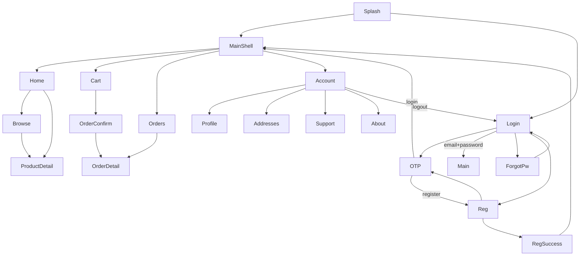

# VeggiiCart (user_app) — Data & Structure Audit

> **Generated from code as of audit date.** Reflects what is built in `/lib` right now — not a proposed schema.
>
> **App branding in code:** `VeggiiCart` (logo assets on Splash / About). Config: `AppConfig.kDemoMode = true`.
>
> **Routing style:** Imperative `Navigator` + `AppPageRoute` only. No GoRouter / named routes table.
>
> **DI:** `provider` (`ChangeNotifierProvider` / `Provider`).

---

## 1. SCREEN-BY-SCREEN INVENTORY

### 1.1 SplashScreen

| | |
|---|---|
| **File** | `lib/views/screens/splash/splash_screen.dart` |
| **Class** | `SplashScreen` |

#### Fields / inputs

| Field Name | Type | Required? | Notes |
|---|---|---|---|
| *(none)* | — | — | No user input |

#### Actions

| Action | Triggers |
|---|---|
| Auto bootstrap (`initState`) | `AuthViewModel.bootstrapSession()` + 500ms delay → `MainShell` if logged in + KYC approved; `VerificationStatusScreen` if logged in but KYC pending/rejected; else `LoginScreen` |

#### Validation

| Rule | Detail |
|---|---|
| None | — |

#### Hardcoded in widget

- Logo asset `assets/branding/veggiicart_logo_transparent.png` on white card over Deep Forest → Primary Green diagonal gradient
- Minimum delay `500ms`

---

### 1.2 LoginScreen

| | |
|---|---|
| **File** | `lib/views/screens/auth/login_screen.dart` |
| **Class** | `LoginScreen` |

#### Fields / inputs

| Field Name | Type | Required? | Notes |
|---|---|---|---|
| `_tab` | `mobile` \| `email` | — | Top toggle: **Mobile Number** \| **Email & Password** |
| `_mobileController` | `String` | Yes (mobile tab) | Digits only; synced to `AuthViewModel.mobile` |
| `_mobileError` | `String?` | — | Local validation / API error display |
| Country code chip | `String` | — | Display-only hardcoded `+91` |
| `_emailController` | `String` | Yes (email tab) | Validated email format |
| `_passwordController` | `String` | Yes (email tab) | Obscured; show/hide eye toggle; min length 6 |
| `_emailError` / `_passwordError` | `String?` | — | Field errors |

#### Actions

| Action | Triggers |
|---|---|
| **Send OTP** (Mobile tab) | Validate → `auth.startLoginFlow()` → `auth.setMobile` → `auth.sendOtp()` → push `OtpScreen` |
| **Login** (Email tab) | Validate → `auth.loginWithEmail` → `pushAndRemoveUntil` `MainShell` |
| **Forgot Password?** | Push `ForgotPasswordScreen` stub (demo: “Reset link sent…”, no real email) |
| **Register your business** | `auth.startRegisterFlow()` → push `RegistrationScreen` (mobile+OTP only; email login is for returning users) |

#### Validation

| Rule | Detail |
|---|---|
| Mobile length | Exactly `10` digits |
| Input formatters | Digits only, max length 10 |
| Email format | Basic `local@domain.tld` |
| Password | Length ≥ 6 (demo) |
| Error copy | Mobile / email / password validation messages |

#### Related

- Profile Details: **“Set a password for faster login”** opt-in → `auth.setLoginPassword` → sets `User.hasPassword` + email

---

### 1.2a ForgotPasswordScreen

| | |
|---|---|
| **File** | `lib/views/screens/auth/forgot_password_screen.dart` |
| **Class** | `ForgotPasswordScreen` |

Demo stub confirmation only — no API / no email send.
### 1.3 OtpScreen

| | |
|---|---|
| **File** | `lib/views/screens/auth/otp_screen.dart` |
| **Class** | `OtpScreen` (`resumeRegistration: bool`) |

#### Fields / inputs

| Field Name | Type | Required? | Notes |
|---|---|---|---|
| `_controllers` (4) → `_otp` | `String` | Yes | 4 single-digit boxes joined |
| `_seconds` | `int` | — | Resend countdown display |
| `auth.mobile` (masked) | `String` | — | Read-only display |
| `auth.error` | `String?` | — | Error display |

#### Actions

| Action | Triggers |
|---|---|
| Back | `Navigator.pop` |
| Auto-verify / **Verify OTP** | `auth.verifyOtp(_otp, persistSession: …)` → login: `pushAndRemoveUntil` `MainShell`; register: `pushReplacement` `RegistrationScreen(initialStep: 1)` |
| **Resend OTP** | When `_seconds == 0`: `auth.sendOtp()` + restart timer + snackbar |

#### Validation

| Rule | Detail |
|---|---|
| OTP length | Exactly 4 digits (`_length = 4`) |
| Digits only | Per box |
| Repo check | Must equal `AuthRepository.demoOtp` (`'1234'`) |

#### Hardcoded in widget

- Timer start `28` seconds
- SnackBar: `'OTP resent (demo: 1234)'`
- UI shows `Demo: ${AuthRepository.demoOtp}`

---

### 1.4 RegistrationScreen

| | |
|---|---|
| **File** | `lib/views/screens/auth/registration_screen.dart` |
| **Class** | `RegistrationScreen` (`initialStep: int`) |

5-step wizard: `_step` ∈ `{0,1,2,3,4}` — Mobile / Business / Address / Documents / Review.

#### Fields / inputs

| Field Name | Type | Required? | Notes |
|---|---|---|---|
| `_mobileController` | `String` | Yes (0) | 10-digit mobile |
| `_businessController` | `String` | Yes (1) | Business / shop name |
| `_ownerController` | `String` | Yes (1) | Owner name |
| `_emailController` | `String` | No (1) | Basic email format if non-empty |
| `auth.businessTypeId` | `String` | Yes (1) | One of 12 `BusinessTypes` ids |
| `_gstController` | `String` | No (1) | GSTIN; max 15 |
| `_fssaiController` | `String` | No (1) | FSSAI license number |
| `_panController` | `String` | No (1) | PAN; max 10 |
| `_shopController` | `String` | Yes (2) | Shop address |
| `auth.sameAsShopAddress` | `bool` | — | When true, delivery mirrors shop |
| `_deliveryController` | `String` | Yes* (2) | Required unless same-as-shop |
| `_cityController` | `String` | Yes (2) | City |
| `auth.state` | `String` | Yes (2) | Indian state dropdown |
| `_landmarkController` | `String` | No (2) | Landmark |
| `_pincodeController` | `String` | Yes (2) | Exactly 6 digits |
| `auth.geoLat` / `geoLng` | `double?` | No (2) | GPS stub via geolocator |
| `auth.documents` | `Map<String,String>` | Partial (3) | Aadhaar + Shop Front required |
| `auth.acceptedTerms` | `bool` | Yes (4) | Terms checkbox |

#### Document types (`RegistrationDocumentType`)

| Id | Label | Required? |
|---|---|---|
| `gstCertificate` | GST Certificate | No (hidden if no GSTIN) |
| `fssaiLicense` | FSSAI License | No |
| `shopRegistration` | Shop Registration | No |
| `msmeCertificate` | MSME Certificate | No |
| `tradeLicense` | Trade License | No |
| `panCard` | PAN Card | No |
| `aadhaarCard` | Aadhaar Card | **Yes** |
| `shopFrontPhoto` | Shop Front Photo | **Yes** |
| `visitingCard` | Business Visiting Card | No |

#### Actions

| Action | Triggers |
|---|---|
| Back | Decrement step / pop |
| **Continue** (0) | OTP → `OtpScreen(resumeRegistration: true)` |
| **Continue** (1–3) | Advance step after validation |
| **Submit Application** (4) | `completeRegistration` → seed address → `VerificationStatusScreen` |
| Pin location | Geolocator GPS capture |
| Document card | Camera / Gallery / PDF (`file_picker`) |

#### Validation

| Rule | Detail |
|---|---|
| Step 0 | Mobile exactly 10 digits |
| Step 1 | Business + owner required; email format if present; GST max 15; PAN max 10 |
| Step 2 | Shop, city, state, pincode(6); delivery unless same-as-shop |
| Step 3 | Aadhaar + Shop Front uploaded |
| Step 4 | Terms accepted |

---

### 1.5 VerificationStatusScreen

| | |
|---|---|
| **File** | `lib/views/screens/auth/verification_status_screen.dart` |
| **Class** | `VerificationStatusScreen` |

#### Fields / inputs

| Field Name | Type | Required? | Notes |
|---|---|---|---|
| `user.kycStatus` | `KycStatus` | — | `pending` / `approved` / `rejected` |
| `user.kycRejectionReason` | `String?` | — | Shown when rejected |

#### Actions

| Action | Triggers |
|---|---|
| **Continue in Demo Mode** | Only if `AppConfig.kDemoMode` + pending → `approveKycDemo()` → `MainShell` |
| **Go to Home** | When approved → `MainShell` |
| **Re-upload Documents** | When rejected → `RegistrationScreen(initialStep: 3)` |

> Legacy `RegistrationSuccessScreen` remains in codebase but is no longer on the registration path.

---
### 1.6 MainShell

| | |
|---|---|
| **File** | `lib/views/screens/home/main_shell.dart` |
| **Class** | `MainShell` |

#### Fields / inputs

| Field Name | Type | Required? | Notes |
|---|---|---|---|
| `ShellController.tabIndex` | `int` | — | 0=Home, 1=Cart, 2=Orders, 3=Account |
| `CartViewModel.itemCount` | `int` | — | Badge (capped display `99+`) |

#### Actions

| Action | Triggers |
|---|---|
| Tab taps | `shell.goToTab(i)` → `IndexedStack` of Home / Cart / Orders / Account |
| Sticky cart bar | `shell.goToCart()` (tab 1) |

---

### 1.7 HomeScreen

| | |
|---|---|
| **File** | `lib/views/screens/home/home_screen.dart` |
| **Class** | `HomeScreen` |

#### Fields / inputs (display + interaction)

| Field Name | Type | Required? | Notes |
|---|---|---|---|
| Delivery label | `String` | — | From `AddressViewModel.defaultAddress` → `label · city`, or `'Add delivery address'` |
| Profile avatar | `User?` | — | From `AuthViewModel.user` |
| Search (tap-only) | — | — | Placeholder; no text entry on Home — opens browse |
| Categories | `List<ProductCategory>` | — | `id`, short label |
| Section products | `List<Product>` | — | Via `HomeViewModel.productsForCategory` |
| Product card: `name` | `String` | — | |
| Product card: `price` | `double?` | — | Shows `'Price TBA'` if null |
| Product card: `unit` | `String` | — | |
| Product card: `moq` + `unitNoun` | `int` + `String` | — | |
| Cart qty on card | `int` | — | `CartViewModel.quantityOf(product.id)` |
| Banner titles | `String` | — | Hardcoded carousel (3 banners) |
| Product count teaser | `int` / `String` | — | `home.products.length` or fallback `'33'` |

#### Actions

| Action | Triggers |
|---|---|
| Location row | `showLocationPickerSheet` |
| Search / browse / category / See All | push `CategoryBrowseScreen(initialCategoryId?, initialQuery?)` |
| Profile avatar | `shell.goToTab(3)` (Account) |
| Product tap | push `ProductDetailScreen(productId:)` |
| Card `+` / `−` | `cart.quickAdd` / `cart.quickDecrement` |
| Pull-to-refresh | `HomeViewModel.refresh` |
| Init | `HomeViewModel.init` |

#### Hardcoded in widget

- Banner copy: *Flat 10% off…*, *Fresh greens…*, *Free delivery…*
- Fallback product count `'33'`

---

### 1.8 CategoryBrowseScreen

| | |
|---|---|
| **File** | `lib/views/screens/catalog/category_browse_screen.dart` |
| **Class** | `CategoryBrowseScreen` (+ nested `_FilterSheet`) |

#### Fields / inputs

| Field Name | Type | Required? | Notes |
|---|---|---|---|
| `_search` → `vm.searchQuery` | `String` | No | Debounced 350ms |
| `vm.selectedCategoryId` | `String` | — | Sidebar selection |
| Filter price range | `double`–`double` | — | `filterMinPrice` / `filterMaxPrice` (default 0–5000) |
| `_stockOnly` / `vm.inStockOnly` | `bool` | — | |
| `_sort` / `vm.sort` | `BrowseSort` enum | — | `popularity`, `priceLowHigh`, `priceHighLow` |
| Grid products | `List<Product>` | — | ProductCard fields |
| `vm.activeFilterCount` | `int` | — | Badge |

#### Actions

| Action | Triggers |
|---|---|
| Back | `Navigator.maybePop` |
| Category select | `vm.selectCategory` |
| Open filters | Modal `_FilterSheet` |
| Reset filters | `vm.resetFilters` + pop |
| Apply filters | `vm.applyFilters(...)` + pop |
| Product tap | push `ProductDetailScreen` |
| Error retry | `vm.refresh` |

#### Validation

| Rule | Detail |
|---|---|
| None beyond local filter math | Price/stock/sort applied client-side |

---

### 1.9 ProductDetailScreen

| | |
|---|---|
| **File** | `lib/views/screens/product/product_detail_screen.dart` |
| **Class** | `ProductDetailScreen` (`productId: String`) |

#### Fields / inputs

| Field Name | Type | Required? | Notes |
|---|---|---|---|
| `_qty` | `int` | Yes | Init = `product.moq` |
| `product.name` | `String` | — | RO |
| `product.category` · `product.unit` | `String` | — | RO |
| `product.price` | `double?` | — | `'Price TBA'` if null |
| `product.moq` + `unitNoun` | `int` + `String` | — | RO |
| `product.stock` | `int?` | — | Or `'Stock available'` |
| `product.inStock` | `bool` | — | Badge |
| CTA total | `double` | — | `displayPrice * _qty` |

#### Actions

| Action | Triggers |
|---|---|
| Back | `Navigator.pop` |
| StepperQty | `_setQty` — min=`moq`, max=`stockCount` or `999` |
| **Add to Cart — ₹…** | `CartViewModel.addProduct(product, quantity: _qty)` + fly-to-cart |
| Error retry | `ProductRepository.getProductById` |

#### Validation

| Rule | Detail |
|---|---|
| Qty min | `product.moq` |
| Qty max | `product.stockCount` if > 0, else `999` |

---

### 1.10 CartScreen

| | |
|---|---|
| **File** | `lib/views/screens/cart/cart_screen.dart` |
| **Class** | `CartScreen` |

#### Fields / inputs

| Field Name | Type | Required? | Notes |
|---|---|---|---|
| `cart.items` | `List<CartItem>` | — | |
| `item.product.name` | `String` | — | |
| `item.quantity` | `int` | — | Stepper; min = MOQ |
| `item.lineTotal` | `double` | — | |
| `cart.subtotal` | `double` | — | |
| `cart.total` | `double` | — | |
| Delivery row | `String` | — | Static `'Free · COD'` |
| `_placeState` | `PrimaryButtonState` | — | idle/loading/success |

#### Actions

| Action | Triggers |
|---|---|
| Qty change | `cart.updateQuantity(productId, q)` |
| Remove / swipe | `cart.remove(productId)` |
| **Place Order (COD)** | `OrderRepository.placeOrder(items, addressId: 'addr_demo_1')` → clear cart → push `OrderConfirmationScreen` |
| Empty CTA **Browse Catalog** | `shell.goToHome` |

#### Validation

| Rule | Detail |
|---|---|
| Empty cart | Early-return; cannot place |
| Line qty min | `product.moq` |

#### Hardcoded

- `addressId: 'addr_demo_1'` (does **not** match seeded address ids `a1` / `a2`)
- Place payload shape: `{ product_id: String, quantity: int }`

---

### 1.11 OrderConfirmationScreen

| | |
|---|---|
| **File** | `lib/views/screens/orders/order_confirmation_screen.dart` |
| **Class** | `OrderConfirmationScreen` (`order: Order`) |

#### Fields / inputs

| Field Name | Type | Required? | Notes |
|---|---|---|---|
| `order.id` | `String` | — | |
| `order.total` | `double` | — | |
| `order.items.length` | `int` | — | |

#### Actions

| Action | Triggers |
|---|---|
| **Track Order** | pop → `shell.goToOrders()` → root push `OrderDetailScreen(orderId:)` |
| **Back to catalog** | pop → `shell.goToHome()` |

---

### 1.12 OrderDetailScreen (tracking)

| | |
|---|---|
| **File** | `lib/views/screens/orders/order_detail_screen.dart` |
| **Class** | `OrderDetailScreen` (`orderId: String`) |

#### Fields / inputs

| Field Name | Type | Required? | Notes |
|---|---|---|---|
| `order.id` | `String` | — | |
| `order.total` | `double` | — | |
| `order.placedAt` | `DateTime` | — | |
| Payment label | `String` | — | Hardcoded `'Cash on Delivery'` (not bound to `order.paymentMethod`) |
| Timeline | `OrderStatus` + `DateTime?` | — | `status` + `estimatedDeliveryDate` |
| Line: `product.name` | `String` | — | |
| Line: `quantity` | `int` | — | |
| Line: `product.unit` | `String` | — | |
| Line: `lineTotal` | `double` | — | |

#### Actions

| Action | Triggers |
|---|---|
| Pull refresh / retry | `OrderRepository.fetchOrderDetail` |
| AppBar back | pop |

---

### 1.13 OrdersScreen (history)

| | |
|---|---|
| **File** | `lib/views/screens/orders/orders_screen.dart` |
| **Class** | `OrdersScreen` |

#### Fields / inputs

| Field Name | Type | Required? | Notes |
|---|---|---|---|
| `_filter` | `String` | — | `all` / `pending` / `delivered` / `cancelled` |
| `_orders` | `List<Order>` | — | |
| Card: `order.id` | `String` | — | |
| Card: `status.label` | `String` | — | From enum |
| Card: `placedAt` | `DateTime` | — | |
| Card: item name preview | `String` | — | |
| Card: `total` | `double` | — | |
| Payment label | `String` | — | Hardcoded `'Cash on Delivery'` |

#### Actions

| Action | Triggers |
|---|---|
| Filter chip | set `_filter` + `OrderRepository.fetchOrders` |
| Order card | push `OrderDetailScreen(orderId:)` |
| Infinite scroll | `_loadMore` (`_pageSize = 2`) |
| Refresh / tab re-enter | `_load(reset: true)` |
| Empty CTA | `shell.goToTab(0)` |

---

### 1.14 AccountScreen

| | |
|---|---|
| **File** | `lib/views/screens/account/account_screen.dart` |
| **Class** | `AccountScreen` |

#### Fields / inputs

| Field Name | Type | Required? | Notes |
|---|---|---|---|
| `user.businessName` | `String` | — | Fallback `'Your business'` |
| `user.mobile` | `String` | — | Shown as `+91 …` |

#### Actions

| Action | Triggers |
|---|---|
| **Edit** | push `ProfileDetailsScreen` |
| **My Orders** | `shell.goToOrders` |
| **Saved Addresses** | push `AddressesScreen` |
| **Help & Support** | push `SupportScreen` |
| **About** | push `AboutScreen` |
| **Log Out** | `auth.logout()` → `pushAndRemoveUntil` `LoginScreen` |

---

### 1.15 ProfileDetailsScreen

| | |
|---|---|
| **File** | `lib/views/screens/account/profile_details_screen.dart` |
| **Class** | `ProfileDetailsScreen` |

#### Fields / inputs

| Field Name | Type | Required? | Notes |
|---|---|---|---|
| `auth.user.avatarPath` | `String?` | No | Camera/gallery crop → local path (demo) |
| `_business` | `String` | Yes | Business name |
| `_type` | `String` | Yes | Same 4 chips as registration |
| `_gst` | `String` | No | Alphanumeric, max 15 |
| `_contact` | `String` | No | Contact person |
| `_mobile` | `String` | — | **Read-only** |
| Email / password opt-in | — | Optional | “Set a password for faster login” → `setLoginPassword` |

#### Actions

| Action | Triggers |
|---|---|
| Avatar badge | Source sheet → `auth.uploadAvatar` / `auth.removeAvatar` |
| **Save Changes** | `auth.updateProfile(businessName, businessType, gstNumber, contactPerson)` → snackbar → pop |
| **Enable Email Login** | `auth.setLoginPassword(email, password)` → sets `User.hasPassword` |

#### Validation

| Rule | Detail |
|---|---|
| Save enabled | Only if `_dirty && _business.trim().isNotEmpty` |
| GST | Alphanumeric + max length 15 |

---

### 1.16 AddressesScreen

| | |
|---|---|
| **File** | `lib/views/screens/account/addresses_screen.dart` |
| **Class** | `AddressesScreen` (+ `_AddressSheet`) |

#### List display

| Field Name | Type | Required? | Notes |
|---|---|---|---|
| `address.label` | `String` | — | |
| `address.isDefault` | `bool` | — | |
| `address.fullAddress` | `String` | — | Computed getter |

#### Sheet fields

| Field Name | Type | Required? | Notes |
|---|---|---|---|
| `_label` | `String` | Yes | Chips: `Home` / `Warehouse` / `Shop` |
| `_line1` | `String` | Yes | |
| `_line2` | `String?` | No | |
| `_city` | `String` | Yes | |
| `_pincode` | `String` | Yes | Length 6 |
| `_isDefault` | `bool` | — | |

#### Actions

| Action | Triggers |
|---|---|
| **Add New Address** / Edit | Modal sheet → `AddressViewModel.upsert` |
| Delete / swipe | Confirm → `remove` + Undo snackbar → `undoDelete` |

#### Validation

| Rule | Detail |
|---|---|
| `_valid` | `line1` + `city` non-empty; pincode length 6 |
| New id | `'a_${DateTime.now().millisecondsSinceEpoch}'` |

---

### 1.17 SupportScreen

| | |
|---|---|
| **File** | `lib/views/screens/account/support_screen.dart` |
| **Class** | `SupportScreen` (+ `_TicketSheet`) |

#### Fields / inputs

| Field Name | Type | Required? | Notes |
|---|---|---|---|
| `_search` | `String` | No | FAQ filter |
| `_expandedFaq` | `int?` | — | |
| FAQ list | 4 hardcoded Q/A pairs | — | Not from model |
| `_ticketId` | `String?` | — | Local fake `SPT-…` after submit |
| `_subject` | `String` | Yes | Chips: `Order Issue`, `Delivery Issue`, `Product Issue`, `Account Issue`, `Other` |
| `_desc` | `String` | Yes | Description |
| `_relatedOrderId` | `String?` | No | Optional related order |
| `_orders` | `List<Order>` | — | Loaded for chips |

#### Actions

| Action | Triggers |
|---|---|
| FAQ expand | Toggle `_expandedFaq` |
| **Raise a Support Ticket** | Modal `_TicketSheet` |
| **Submit Ticket** | Fake 700ms delay → local id only (**not persisted / no API**) |
| **Call Support** | `tel:+918000000000` |
| **WhatsApp** | `https://wa.me/918000000000?text=…` |

#### Validation

| Rule | Detail |
|---|---|
| Submit enabled | Description non-empty |

#### Hardcoded

- Support phone `+918000000000`
- 4 FAQ entries
- Ticket id formula local-only

---

### 1.18 AboutScreen

| | |
|---|---|
| **File** | `lib/views/screens/account/about_screen.dart` |
| **Class** | `AboutScreen` |

#### Fields / inputs

| Field Name | Type | Required? | Notes |
|---|---|---|---|
| Brand | `String` | — | Logo image / `'VeggiiCart'` |
| Tagline / Terms / Privacy / Payment bodies | `String` | — | Hardcoded copy |
| Version | `String` | — | `'Version 1.0.0'` |

#### Actions

| Action | Triggers |
|---|---|
| *(none)* | Read-only |

---

### Related UI surfaces (not full screens)

| Widget | File | Role |
|---|---|---|
| `showLocationPickerSheet` | `lib/views/widgets/location_picker_sheet.dart` | Lists addresses; set default; push Addresses |
| `StickyCartBar` | `lib/views/widgets/sticky_cart_bar.dart` | Shows `itemCount` + `total`; `goToCart` |
| `ProductCard` | `lib/views/widgets/product_card.dart` | Catalog tile + quick add/decrement |
| `StatusTimeline` | `lib/views/widgets/status_timeline.dart` | Order status steps |
| `MoqBadge` | `lib/views/widgets/moq_badge.dart` | **Defined but unused** by screens |

---

## 2. MODEL INVENTORY

### 2.1 `Product` — `lib/models/product.dart`

| Property | Type | Required? | Notes |
|---|---|---|---|
| `id` | `String` | Yes | |
| `name` | `String` | Yes | |
| `category` | `String` | Yes | Display name |
| `categoryId` | `String` | Yes | Filter/nav id |
| `unit` | `String` | Yes | e.g. `per kg`, `per bunch` |
| `moq` | `int` | Yes | Minimum order quantity |
| `price` | `double?` | No | Wholesale; UI shows TBA if null |
| `stock` | `int?` | No | |
| `imageUrl` | `String?` | No | |
| `batchNo` | `String?` | No | Comment: admin/backend-only; not in UI |
| `itemCode` | `String?` | No | Comment: admin/backend-only; not in UI |
| `description` | `String?` | No | **Never shown** on any screen currently |
| `inStock` | `bool` | Default `true` | |

**Computed getters:** `unitNoun`, `displayPrice` (`price ?? 0`), `stockCount` (`stock ?? 0`), `fallbackImageUrl`, `primaryImageUrl`

**JSON:** `fromJson` / `toJson` with snake_case + camelCase aliases.

---

### 2.2 `ProductCategory` — same file

| Property | Type | Required? | Notes |
|---|---|---|---|
| `id` | `String` | Yes | |
| `name` | `String` | Yes | |

**JSON:** `fromJson` only (no `toJson`).

---

### 2.3 `CartItem` — `lib/models/cart_item.dart`

| Property | Type | Required? | Notes |
|---|---|---|---|
| `product` | `Product` | Yes | Nested |
| `quantity` | `int` | Yes | |

**Computed:** `lineTotal` → `product.displayPrice * quantity`  
**Also:** `copyWith`, `fromJson`, `toJson`

---

### 2.4 `Order` — `lib/models/order.dart`

| Property | Type | Required? | Notes |
|---|---|---|---|
| `id` | `String` | Yes | e.g. `VC-10428` |
| `items` | `List<CartItem>` | Yes | |
| `status` | `OrderStatus` | Yes | Enum |
| `subtotal` | `double` | Yes | |
| `deliveryFee` | `double` | Yes | Mock always `0` |
| `total` | `double` | Yes | |
| `placedAt` | `DateTime` | Yes | |
| `estimatedDeliveryDate` | `DateTime?` | No | |
| `deliveryAddress` | `String?` | No | |
| `paymentMethod` | `String` | Default `'COD'` | UI often hardcodes COD label instead |

**JSON:** `fromJson` / `toJson`

---

### 2.5 `OrderStatus` — `lib/models/order_status.dart`

| Enum value | `label` (UI chip) | `timelineLabel` | `toApi()` |
|---|---|---|---|
| `placed` | Placed | Placed | `placed` |
| `confirmed` | Awaiting Delivery Date | Confirmed | `confirmed` |
| `deliveryDateSet` | Delivery Date Set | Delivery Date Set | `delivery_date_set` |
| `outForDelivery` | Out for Delivery | Out for Delivery | `out_for_delivery` |
| `delivered` | Delivered | Delivered | `delivered` |
| `cancelled` | Cancelled | Cancelled | `cancelled` |

`fromApi` also accepts `deliverydateset`, `outfordelivery`, `canceled`. Default → `placed`.

---

### 2.6 `SavedAddress` — `lib/models/saved_address.dart`

| Property | Type | Required? | Notes |
|---|---|---|---|
| `id` | `String` | Yes | |
| `label` | `String` | Yes | UI chips: Home / Warehouse / Shop |
| `line1` | `String` | Yes | |
| `line2` | `String?` | No | |
| `city` | `String` | Yes | |
| `pincode` | `String` | Yes | |
| `isDefault` | `bool` | Default `false` | |

**Computed:** `fullAddress`  
**Also:** `copyWith`, `fromJson`, `toJson`

---

### 2.7 `User` — `lib/models/user.dart`

| Property | Type | Required? | Notes |
|---|---|---|---|
| `id` | `String` | Yes | |
| `mobile` | `String` | Yes | |
| `businessName` | `String` | Yes | |
| `address` | `String?` | No | Composed delivery summary string |
| `gstNumber` | `String?` | No | |
| `email` | `String?` | No | Collected on registration (optional) |
| `contactPerson` | `String?` | No | Synced from owner name |
| `ownerName` | `String?` | No | Registration owner |
| `businessType` | `String?` | No | Label |
| `businessTypeId` | `String?` | No | One of 12 `BusinessTypes` ids |
| `avatarPath` | `String?` | No | Local path (demo) or URL |
| `fssaiNumber` | `String?` | No | |
| `panNumber` | `String?` | No | |
| `shopAddress` | `String?` | No | |
| `deliveryAddress` | `String?` | No | |
| `city` / `state` / `landmark` / `pincode` | `String?` | No | Structured address |
| `geoLat` / `geoLng` | `double?` | No | GPS pin stub |
| `documents` | `Map<String,String>` | No | Doc type id → local path |
| `kycStatus` | `KycStatus` | Default `approved` | Login demo users approved; new regs `pending` |
| `hasPassword` | `bool` | Default `false` | Opt-in email+password login (Profile) |
| `kycRejectionReason` | `String?` | No | |

**Computed:** `initials`, `displayOwnerName`, `businessTypeLabel`  
**Also:** `fromJson`, `toJson`, `copyWith`

---

### 2.8 `KycStatus` — `lib/models/kyc_status.dart`

| Value | Label |
|---|---|
| `pending` | Pending Review |
| `approved` | Approved |
| `rejected` | Rejected |

### 2.9 `RegistrationDocumentType` — `lib/models/registration_document.dart`

See Registration screen inventory (9 types; Aadhaar + Shop Front required).

### 2.10 `BusinessTypes` — `lib/models/business_type.dart`

12 options with stable `id` + `label`: Retail Shop, Kirana Store, Supermarket, Hotel, Restaurant, Catering Service, Hostel, Hospital, Corporate Pantry, Juice Shop, Vendor/Reseller, Other.

### 2.11 UI-only enum

| Enum | File | Values |
|---|---|---|
| `BrowseSort` | `lib/viewmodels/category_browse_view_model.dart` | `popularity`, `priceLowHigh`, `priceHighLow` |

---

## 3. MOCK DATA INVENTORY

### 3.1 `lib/data/mock/mock_products.dart` — `MockProducts`

| Entity | Count | Notes |
|---|---|---|
| `ProductCategory` | **5** | `all`, `green_vegetables`, `root_vegetables`, `seasonal_fruits`, `herbs_leafy` |
| `Product` | **33** | Green 17 + Root 9 + Herbs 2 + Fruits 5 |

#### Category record shape

| Key | Type | Always set? |
|---|---|---|
| `id` | `String` | Yes |
| `name` | `String` | Yes |

#### Product record shape (explicit constructor args)

| Key | Type | Always set? | Match to model? |
|---|---|---|---|
| `id` | `String` | Yes | OK |
| `name` | `String` | Yes | OK |
| `category` | `String` | Yes | OK |
| `categoryId` | `String` | Yes | OK |
| `unit` | `String` | Yes | `per kg` or `per bunch` |
| `moq` | `int` | Yes | OK |
| `price` | `double` | Yes (non-null) | OK (`double?`) |
| `stock` | `int` | Yes (non-null) | OK (`int?`) |
| `imageUrl` | `String` | Yes | loremflickr URLs |
| `batchNo` | — | **Never set** → `null` | Soft gap |
| `itemCode` | — | **Never set** → `null` | Soft gap |
| `description` | — | **Never set** → `null` | Soft gap |
| `inStock` | — | **Never set** → default `true` | Soft gap |

**Mismatch verdict:** No hard type/shape mismatches. Optional fields intentionally omitted.

**Helpers:** `picsumFallback`, `loremFlickr`, `byId`, `byCategory`, `search`

---

### 3.2 `lib/data/mock/mock_orders.dart` — `MockOrders`

| Entity | Count |
|---|---|
| `Order` | **5** |
| Nested `CartItem` | **11** across orders |

| id | status | items | estimatedDeliveryDate | paymentMethod |
|---|---|---|---|---|
| `VC-10428` | `outForDelivery` | 2 | set | default `COD` |
| `VC-10391` | `delivered` | 3 | set | default `COD` |
| `VC-10455` | `confirmed` | 2 | explicit `null` | default `COD` |
| `VC-10440` | `deliveryDateSet` | 3 | set | default `COD` |
| `VC-10350` | `cancelled` | 1 | omitted → `null` | default `COD` |

#### Order record shape

| Key | Always set? | Match to model? |
|---|---|---|
| `id` | Yes | OK |
| `items` | Yes | OK |
| `status` | Yes | OK |
| `subtotal` / `deliveryFee` / `total` | Yes (`deliveryFee` always 0) | OK |
| `placedAt` | Yes | OK |
| `deliveryAddress` | Yes (same string all 5) | OK |
| `estimatedDeliveryDate` | Partial | OK nullable |
| `paymentMethod` | **Never explicit** → `'COD'` | Soft gap |

**Mismatch verdict:** No hard mismatches. Soft notes: `OrderStatus.placed` never in seed list (only created at live placeOrder); subtotals use hardcoded unit prices rather than reading `product.price` at runtime.

---

### 3.3 Models with no mock file

| Model | Mock? |
|---|---|
| `User` | No dedicated mock — demo users created in `AuthRepository` (`u_demo_1`, etc.) |
| `SavedAddress` | No mock file — **seeded inline** in `AddressViewModel` (`a1`, `a2`) |

---

## 4. NAVIGATION MAP

**Entry:** `MaterialApp(home: SplashScreen, navigatorKey: rootNavigatorKey)`  
**Shell tabs (`MainShell` IndexedStack):**

| Index | Screen |
|---|---|
| 0 | `HomeScreen` |
| 1 | `CartScreen` |
| 2 | `OrdersScreen` |
| 3 | `AccountScreen` |

### Edges (from → to)

| From | Operation | To |
|---|---|---|
| App start | `home:` | `SplashScreen` |
| `SplashScreen` | `pushReplacement` | `MainShell` **or** `LoginScreen` |
| `LoginScreen` | `push` | `OtpScreen` (mobile tab) |
| `LoginScreen` | `pushAndRemoveUntil` | `MainShell` (email tab success) |
| `LoginScreen` | `push` | `ForgotPasswordScreen` |
| `LoginScreen` | `push` | `RegistrationScreen` |
| `OtpScreen` (login) | `pushAndRemoveUntil` | `MainShell` |
| `OtpScreen` (register) | `pushReplacement` | `RegistrationScreen(initialStep: 1)` |
| `RegistrationScreen` | `push` | `OtpScreen(resumeRegistration: true)` |
| `RegistrationScreen` | `pushAndRemoveUntil` | `VerificationStatusScreen` |
| `VerificationStatusScreen` | `pushAndRemoveUntil` / `pushReplacement` | `MainShell` or `RegistrationScreen(step 3)` |
| `HomeScreen` | `push` | `CategoryBrowseScreen` |
| `HomeScreen` | `push` | `ProductDetailScreen` |
| `HomeScreen` | modal sheet | Location picker |
| Location picker | `push` | `AddressesScreen` |
| `CategoryBrowseScreen` | `push` | `ProductDetailScreen` |
| `CategoryBrowseScreen` | modal sheet | Filter sheet |
| `CartScreen` | `push` | `OrderConfirmationScreen` |
| `OrderConfirmationScreen` | pop + tab + root push | `OrderDetailScreen` |
| `OrderConfirmationScreen` | pop + `goToHome` | Home tab |
| `OrdersScreen` | `push` | `OrderDetailScreen` |
| `AccountScreen` | `push` | `ProfileDetailsScreen` |
| `AccountScreen` | `push` | `AddressesScreen` |
| `AccountScreen` | `push` | `SupportScreen` |
| `AccountScreen` | `push` | `AboutScreen` |
| `AccountScreen` (logout) | `pushAndRemoveUntil` | `LoginScreen` |
| `ApiClient` 401 | root `pushAndRemoveUntil` | `LoginScreen` |
| Sticky cart / shell helpers | tab switch | Cart / Home / Orders / Account |



---

## 5. STATE / VIEWMODEL INVENTORY

### 5.1 `AuthViewModel` — `lib/viewmodels/auth_view_model.dart`

**Base:** `ChangeNotifier` · **Scope:** global (`main.dart`)  
**Screens:** Splash, Login, OTP, Registration, Account, Profile Details, Home (avatar)

#### State

| Field | Type |
|---|---|
| `isLoading` | `bool` |
| `error` | `String?` |
| `user` | `User?` |
| `mobile` | `String` |
| `businessName` | `String` |
| `businessType` | `String` (default `'Wholesaler'`) |
| `gstNumber` | `String` |
| `address` | `String` |
| `pincode` | `String` |
| `authFlow` | `String` (`'login'` \| `'register'`) |
| `isUploadingAvatar` | `bool` |

#### Methods

| Method | Signature | Purpose |
|---|---|---|
| `setMobile` | `void setMobile(String value)` | Form setter |
| `setBusinessName` | `void setBusinessName(String value)` | Form setter |
| `setBusinessType` | `void setBusinessType(String value)` | Form setter |
| `setGstNumber` | `void setGstNumber(String value)` | Form setter |
| `setAddress` | `void setAddress(String value)` | Form setter |
| `setPincode` | `void setPincode(String value)` | Form setter |
| `startLoginFlow` | `void startLoginFlow()` | `authFlow = login` |
| `loginWithEmail` | `Future<bool> loginWithEmail({required String email, required String password})` | Demo email login → session |
| `setLoginPassword` | `Future<bool> setLoginPassword({required String email, required String password})` | Profile opt-in |
| `startRegisterFlow` | `void startRegisterFlow()` | `authFlow = register` |
| `bootstrapSession` | `Future<bool> bootstrapSession()` | Restore token/user from secure storage |
| `sendOtp` | `Future<bool> sendOtp()` | Mock OTP send |
| `verifyOtp` | `Future<bool> verifyOtp(String otp, {bool persistSession = true})` | Mock verify (`1234`) |
| `completeRegistration` | `Future<bool> completeRegistration()` | Mock register + persist |
| `updateProfile` | `Future<bool> updateProfile({required String businessName, required String businessType, String? gstNumber, String? contactPerson})` | Mock profile update |
| `uploadAvatar` | `Future<bool> uploadAvatar(String localPath)` | Mock avatar path store |
| `removeAvatar` | `Future<bool> removeAvatar()` | Clear avatar |
| `logout` | `Future<void> logout()` | Clear session + form |

---

### 5.2 `HomeViewModel` — `lib/viewmodels/home_view_model.dart`

**Screens:** Home

| Field | Type |
|---|---|
| `isLoading` | `bool` |
| `error` | `String?` |
| `products` | `List<Product>` |
| `categories` | `List<ProductCategory>` |
| `homeSectionCategoryIds` | `static const List<String>` — green/root/fruits/herbs |

| Method | Purpose |
|---|---|
| `init()` | Load categories + products |
| `loadCategories()` | Via `ProductRepository` (mock) |
| `refresh()` | `getAllProducts()` |
| `productsForCategory(String categoryId, {int limit = 8})` | Local filter |
| `categoryById(String id)` | Local lookup |

---

### 5.3 `CartViewModel` — `lib/viewmodels/cart_view_model.dart`

**Screens/widgets:** MainShell badge, StickyCartBar, ProductCard, Cart, Product Detail  
**Backing:** Fully local / in-memory (no cart API)

| Field / getter | Type |
|---|---|
| `items` | `List<CartItem>` |
| `itemCount` | `int` |
| `subtotal` | `double` |
| `deliveryFee` | `double` (always `0`; comment TBD from API) |
| `total` | `double` |

| Method | Purpose |
|---|---|
| `quantityOf(String productId)` | Lookup |
| `quickAdd(Product)` | First add uses MOQ |
| `quickDecrement(Product)` | Remove at/below MOQ |
| `addProduct(Product, {int? quantity})` | Add/set |
| `updateQuantity(String productId, int quantity)` | Update |
| `remove(String productId)` | Remove line |
| `clear()` | Empty cart |

---

### 5.4 `AddressViewModel` — `lib/viewmodels/address_view_model.dart`

**Screens:** Home (label), Addresses, Location picker  
**Backing:** Hardcoded seed list (no repository)

| Field / getter | Type |
|---|---|
| `addresses` | `List<SavedAddress>` |
| `defaultAddress` | `SavedAddress?` |

**Seeded records (2):**

| id | label | city | pincode | isDefault |
|---|---|---|---|---|
| `a1` | Shop | Bengaluru | 560001 | true |
| `a2` | Warehouse | Bengaluru | 560058 | false |

| Method | Purpose |
|---|---|
| `setDefault(String id)` | Mark default |
| `upsert(SavedAddress)` | Insert/update |
| `remove(String id)` | Delete + undo buffer |
| `undoDelete()` | Restore |

---

### 5.5 `CategoryBrowseViewModel` — `lib/viewmodels/category_browse_view_model.dart`

**Scope:** Local provider inside `CategoryBrowseScreen` only

| Field | Type |
|---|---|
| `isLoading` | `bool` |
| `error` | `String?` |
| `products` | `List<Product>` |
| `categories` | `List<ProductCategory>` |
| `selectedCategoryId` | `String` |
| `searchQuery` | `String` |
| `minPrice` / `maxPrice` | `double` (bounds 0 / 5000) |
| `filterMinPrice` / `filterMaxPrice` | `double` |
| `inStockOnly` | `bool` |
| `sort` | `BrowseSort` |
| `activeFilterCount` | `int` (getter) |

| Method | Purpose |
|---|---|
| `init({String? categoryId, String? query})` | Load + refresh |
| `loadCategories()` | Repo |
| `refresh()` | search / by-category / all + local filters |
| `selectCategory(String id)` | Refresh |
| `onSearchChanged(String value)` | Debounced refresh |
| `applyFilters({required double min, required double max, required bool stockOnly, required BrowseSort sortBy})` | Apply |
| `resetFilters()` | Reset |
| `dispose()` | Cancel debounce |

---

### 5.6 `ShellController` — `lib/core/ui/shell_controller.dart`

**Screens:** MainShell, Home, StickyCartBar, Cart, Account, Orders, Order Confirmation, Product Detail

| Field | Type |
|---|---|
| `tabIndex` | `int` |
| `cartIconKey` | `GlobalKey` |
| `stickyCartKey` | `GlobalKey` |

| Method | Purpose |
|---|---|
| `goToTab(int)` / `goToCart` / `goToHome` / `goToOrders` | Tab navigation |
| `cartIconGlobalCenter()` | Fly-to-cart overlay target |

---

### No dedicated ViewModels

Orders, Order Detail, Support tickets, Checkout — screens call `OrderRepository` (or local state) directly.

---

## 6. REPOSITORY / API CONTRACT STUBS

**Base URL (placeholder):** `https://api.veggiicart.example/v1` (`ApiClient.kDefaultBaseUrl`)  
**Demo gate:** `AppConfig.kDemoMode = true`

### 6.1 Endpoint catalog — `lib/services/api/api_endpoints.dart`

| Constant / method | Path | Wired today? |
|---|---|---|
| `sendOtp` | `/auth/send-otp` | Defined only — AuthRepo never calls |
| `verifyOtp` | `/auth/verify-otp` | Defined only |
| `logout` | `/auth/logout` | Defined only |
| `profile` | `/auth/profile` | Defined only |
| `products` | `/products` | Intended; `UnimplementedError` in ApiProductRepo |
| `categories` | `/categories` | Scaffolded in ApiProductRepo |
| `productDetail(id)` | `/products/$id` | Scaffolded |
| `productSearch` | `/products/search` | Defined only |
| `cart` | `/cart` | Defined only — Cart is local |
| `placeOrder` / `orders` | `/orders` | Scaffolded in OrderRepo when not demo |
| `orderDetail(id)` | `/orders/$id` | Scaffolded |
| `addresses` | `/addresses` | Defined only — AddressVM local |

---

### 6.2 `AuthRepository` — `lib/repositories/auth_repository.dart`

**Backing:** **Always mock** (delays + `SecureStorageService`). Never uses Dio.

| Method signature | Mock / real |
|---|---|
| `Future<Result<void>> sendOtp({required String mobile, String businessName = ''})` | Mock delay; length check |
| `Future<Result<User>> verifyOtp({required String mobile, required String otp, String businessName = '', bool persistSession = true})` | Mock; OTP must be `'1234'`; demo user `u_demo_1` |
| `Future<Result<User>> loginWithEmail({required String email, required String password})` | Mock; well-formed email + password length ≥ 6 → approved demo user + session |
| `Future<Result<User>> setLoginPassword({required String email, required String password})` | Mock; sets `User.email` + `hasPassword` on current user |
| `Future<Result<User>> completeRegistration({…})` | Mock persist; KYC `pending` |
| `Future<Result<User>> updateProfile({required User user})` | Mock write storage |
| `Future<Result<User>> uploadAvatar({required String localPath})` | Mock local path on user JSON |
| `Future<Result<User>> removeAvatar()` | Mock clear |
| `Future<User?> currentUser()` | Read storage |
| `Future<bool> isLoggedIn()` | `hasToken` |
| `Future<void> logout()` | `clearSession` |

**Demo constant:** `AuthRepository.demoOtp = '1234'`

> **UI color tokens (not schema):** Step 14 replaced violet/yellow with logo-sampled greens — Primary `#12833B`, Deep Forest `#0B5C27`, Ink `#1E1F22`, Accent amber `#F5A623`, section `#F4FAF6`. See `lib/theme/colors.dart`. Irrelevant to DB schema.
---

### 6.3 `ProductRepository` — `lib/repositories/product_repository.dart`

Factory: `kDemoMode` → `MockProductRepository` else `ApiProductRepository`.

| Method signature | Mock (active) | Live API stub |
|---|---|---|
| `Future<Result<List<ProductCategory>>> getCategories()` | `MockProducts.categories` | `GET /categories` |
| `Future<Result<List<Product>>> getAllProducts()` | All 33 products | **`UnimplementedError`** (TODO) |
| `Future<Result<List<Product>>> getProductsByCategory(String category)` | Filter by `categoryId` | **`UnimplementedError`** (TODO) |
| `Future<Result<List<Product>>> searchProducts(String query)` | Local search | **`UnimplementedError`** (TODO) |
| `Future<Result<Product>> getProductById(String id)` | `byId` | `GET /products/$id` |

---

### 6.4 `OrderRepository` — `lib/repositories/order_repository.dart`

Helper type:

```dart
class PaginatedOrders {
  final List<Order> items;
  final int page;
  final int limit;
  final int total;
  final bool hasMore;
}
```

| Method signature | Mock (active) | Live API stub |
|---|---|---|
| `Future<Result<PaginatedOrders>> fetchOrders({int page = 1, int limit = 20, String? filter})` | `MockOrders` + local filter/paging | `GET /orders?page&limit` (**filter query not sent**) |
| `Future<Result<Order>> placeOrder({required List<Map<String, dynamic>> items, required String addressId})` | Builds from `MockProducts`, inserts into `MockOrders` | `POST /orders` body `{items, address_id, payment_method: 'COD'}` |
| `Future<Result<Order>> fetchOrderDetail(String id)` | Find in `MockOrders` | `GET /orders/$id` |

**Place-order cart payload (from CartScreen):**

```json
{ "product_id": "<string>", "quantity": <int> }
```

---

### 6.5 Storage — `SecureStorageService`

| Key | Purpose |
|---|---|
| `auth_token` | JWT / demo token |
| `user_json` | Serialized `User` |
| `business_name` | Cached business name for OTP/login |

---

## 7. GAPS / INCONSISTENCIES CALLOUT

### Critical for DB/API design

1. **Checkout address disconnect**  
   Cart places order with hardcoded `addressId: 'addr_demo_1'`, but seeded addresses are `a1` / `a2`. Demo `placeOrder` **ignores** `addressId` and hardcodes delivery address string. Need: select default/selected address → real `address_id`.

2. **No Address repository / JSON**  
   `SavedAddress` has no `fromJson`/`toJson`; `ApiEndpoints.addresses` unused; AddressVM is in-memory only. API contract for addresses is undefined in code.

3. **No Cart API**  
   Cart is 100% local. Endpoint `/cart` exists but unused. Clarify whether cart is server-side or client-only at place-order time (current place payload is only `product_id` + `quantity`).

4. **Auth never hits HTTP**  
   Endpoints for send/verify OTP, logout, profile exist but `AuthRepository` is always mock. Profile updates write secure storage only.

5. **`User.email` unused**  
   Property exists on model + JSON, but no screen collects or displays it.

6. **`Product.description` unused in UI**  
   Field exists; mock never sets it; Product Detail does not show it. Decide if PDP needs description/copy.

7. **`Product.batchNo` / `itemCode`**  
   Explicitly reserved for admin/backend; omitted from mocks — fine for customer API responses, but include in DB if admin tools need them.

8. **`businessType` registration quirk**  
   `completeRegistration` persists `business_type` into storage JSON separately, but the `User` object returned in-memory may lack `businessType` until reload (`User(...)` constructor omits it). Profile edit does set it properly.

9. **`User.address` vs `SavedAddress`**  
   Registration stores a single concatenated address string on `User`. Saved addresses are a separate list. No link between `User.address` and default `SavedAddress`.

10. **Payment method dual paths**  
    `Order.paymentMethod` defaults to `'COD'`, but Order list/detail UIs hardcode `'Cash on Delivery'` instead of reading the model field.

11. **Support tickets are fake**  
    Subject/description/related order produce a local `SPT-…` id only — no model, no repository, no persistence.

12. **Cancel-order FAQ vs capability**  
    FAQ mentions cancellation from order details; **OrderDetailScreen has no cancel action**.

13. **Live API incompleteness**  
    `ApiProductRepository.getAllProducts` / `getProductsByCategory` / `searchProducts` throw `UnimplementedError`. Order list live path does not pass `filter` query param. Base URL is placeholder.

14. **Hardcoded marketing / demo values in widgets** (clean before launch)  

| Location | Value |
|---|---|
| OTP UI | Demo OTP `1234` visible |
| Cart | `addressId: 'addr_demo_1'` |
| Support | Phone `+918000000000` |
| Home banners | Promo copy hardcoded (not CMS/API) |
| Home | Fallback product count `'33'` |
| About | `Version 1.0.0` hardcoded |
| Country code | `+91` chip hardcoded |
| Auth demo user | Hardcoded GST / address on login verify |

15. **Branding note**  
    Branding uses **VeggiiCart** / order ids `VC-*`.

16. **`MoqBadge` widget unused**  
    MOQ shown via inline pills on product cards instead.

17. **No OrderViewModel**  
    Orders screens hold local state and call repository directly — fine for now, but inconsistent with Auth/Home/Cart patterns when wiring real API (pagination/error handling).

### TODO comments related to data/API

| Location | Note |
|---|---|
| `product_repository.dart:8-10` | Implement real HTTP; flip `kDemoMode` |
| `product_repository.dart:95` | TODO wire `GET /products` (paginated) |
| `product_repository.dart:101` | TODO wire `GET /products?category_id=…` |
| `product_repository.dart:107` | TODO wire `GET /products?q=…` |
| `cart_view_model.dart:17` | `deliveryFee` — TBD from API |
| `auth_repository.dart` header | “Demo OTP until API is wired” |
| `api_client.dart` | Placeholder base URL |

No `TODO`/`FIXME` inside screen widgets themselves.

---

## Quick entity coverage matrix

| Domain | Model | Mock / seed | Repository | Screens |
|---|---|---|---|---|
| Auth / User | `User` | AuthRepo demo | Auth (mock only) | Splash, Login, OTP, Reg, Account, Profile |
| Catalog | `Product`, `ProductCategory` | 33 + 5 | Product (mock active) | Home, Browse, Detail, cards |
| Cart | `CartItem` | In-memory | None | Cart, cards, detail |
| Orders | `Order`, `OrderStatus` | 5 orders | Order (mock active) | Cart place, Confirm, Orders, Detail |
| Addresses | `SavedAddress` | 2 seeded in VM | None | Addresses, Home picker |
| Support tickets | *(none)* | Local fake id | None | Support |

---

*End of audit. Source of truth: `/lib` as inspected. Do not treat this as the final DB schema — use it as the inventory of what the app already expects.*
